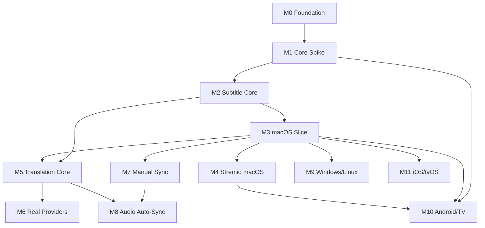

# Nen Player — Roadmap

Üst görünüm. Task ayrıntısı için `tasks/INDEX.md`, milestone ayrıntısı için
`docs/milestones/`.

**Şu anki konum: M3 kapandı (2026-09-07), M4 sürüyor (2026-09-08).** macOS dilimi 46 task
ile tamamlandı: gerçek `.app` dosyayı açıyor, oynatıyor, gömülü track'leri ve
sidecar'ları gruplu menüde gösteriyor, seçileni ekrana çiziyor. Retro
[`milestones/M3-macos-slice.md`](milestones/M3-macos-slice.md)'de.
M4'ün gerçek Stremio → Nen Player akışı, geri alınabilir MPV köprüsü ve gerçek
kabul koşusu (`NEN-087`/`NEN-088`) tamamlanana kadar kapanmayacak.
Güncel durum: [`docs/STATUS.md`](STATUS.md) ·
Kararlar: [`docs/DECISIONS.md`](DECISIONS.md)

## Milestone tablosu

| M | Ad | Bitince ne doğru olur | Durum |
|---|---|---|---|
| **M0** | Foundation | Repo, roadmap/task sistemi, ADR süreci, CI, toolchain doctor, log redaction politikası hazır. | ✅ kapandı |
| **M1** | Core Technical Spike | Rust↔Swift↔Kotlin binding'in async/cancel/typed-error/50k-cue davranışı ölçülmüş; ADR-0002 ile core dili kilitlenmiş (go/no-go); playback ownership yönü ADR-0026 ile karara bağlanmış. | ✅ kapandı |
| **M2** | Subtitle Core | SRT strict parse, WebVTT yazımı, encoding, timeline fingerprint, indeksli cue lookup, media evidence, source catalog — headless test edilmiş. | ✅ kapandı |
| **M3** | macOS Vertical Slice | Dosya aç → oynat → katalog (embedded + sidecar) → altyazı menüsü → seç → ekranda göster. **İlk gerçek ürün.** | ✅ kapandı |
| **M4** | Stremio Handoff (macOS) | Stremio'dan açılan medya macOS'ta doğru pozisyondan oynuyor; argüman/URL loglanmıyor. | 🔵 sürüyor |
| **M5** | Translation Core | Blok pipeline + strict validation + checkpoint/cancel + artifact/cache; mock provider ile uçtan uca doğrulanmış. | ⚪ |
| **M6** | Real Providers | OpenSubtitles resmi API + OpenAI + OpenRouter; secure credential storage; katalogda gerçek adaylar. | ⚪ |
| **M7** | Manual Sync | Offset · replik-temelli anchor · iki-anchor drift; SyncProfile persistence, undo/reset/preview. | ⚪ |
| **M8** | AI Audio-Assisted Sync | VAD + ASR + alignment + confidence + kullanıcı önizleme/onay; varsayılan localOnly. | ⚪ |
| **M9** | Windows / Linux | Aynı core, libmpv adapter, platform secure storage. | ⚪ |
| **M10** | Android / Android TV | Media3, TV navigasyonu, ACTION_VIEW handoff, gerçek cihaz testi. | ⚪ |
| **M11** | iOS / tvOS | AVPlayer, Apple timed-text renderer, sandbox/dosya erişimi. | ⚪ |

## Bağımlılıklar

**Kritik yol:** M0 → M1 → M2 → M3 → M5 → M6

**Sert kilit:** M1 bitmeden M2 dışında hiçbir şey başlamaz. ADR-0002 core dilini
değiştirirse M2 dışındaki her şey yeniden yazılır.

**Paralelleştirilebilir (sıraya sokma esnekliği, eşzamanlı çalışma değil):**
M4↔M5 · M6↔M7 · M9↔M6/M7.

## Şartnameden sapma

Şartnamedeki geliştirme sırasında **tek sapma** var ve kullanıcı tarafından
onaylanmıştır:

> Şartname: `spike → subtitle+translation core → macOS slice → Stremio → ...`
> Roadmap: `spike → subtitle core → macOS slice → Stremio → translation core → ...`

**Gerekçe:** FFI kontratı (async, cancellation, progress, büyük cue listeleri) ve
`PlaybackEngine` capability modeli ürünün tüm ağırlığını taşıyan iki varsayım.
Translation pipeline — en pahalı ve en çok kod içeren parça — bu varsayımların
üzerine kuruluyor. Translation'ı gerçek bir UI'a bağlanmadan önce yazarsak, FFI
veya port hatası ancak haftalar sonra, üstüne çok şey inşa edilmişken ortaya
çıkar. Subtitle core zaten macOS slice'ı için gerekli; translation değil.

## Açık sorular

Yanıtlanan satır **silinmez** — durumu güncellenir ve kararı
[`docs/DECISIONS.md`](DECISIONS.md)'ye bağlanır. Numaralar yeniden kullanılmaz.

| # | Soru | Durum | Karar / not |
|---|---|---|---|
| **S1** | Dağıtım modeli ne? | ✅ kısmen cevaplandı (2026-08-24) | Şimdilik **kişisel kullanım + side-loading**. Public dağıtım kararı ertelendi → **S11** |
| **S2** | AI çeviri maliyetini kim karşılıyor? | ✅ cevaplandı (2026-08-24) | Kullanıcı **kendi** OpenSubtitles/OpenAI/OpenRouter anahtarını girer. **Hosted backend yok** |
| **S3** | Çeviri kalite hedefi: "anlaşılır" mı, "yayın kalitesi" mi? | ❓ açık | Operasyonel **ölçüt** tanımlanmalı. Blok boyutu, context derinliği, repair bütçesi, model seçimi buna bağlı — M5 |
| **S4** | Offline/uçak modu birinci sınıf senaryo mu? | ❓ açık | S8 ("cloud sync non-goal") bunu kısmen etkiliyor: sync yoksa offline davranış tamamen yerel cache'e bağlı — M5–M6 |
| **S5** | Uzak medya ne kadar destekleniyor? | ✅ cevaplandı (2026-08-24) | Genel **file/http/https** açma desteklenir. Stremio önemli bir giriş kaynağı, **tek remote kaynak değil** |
| **S6** | Auto-sync'te ASR yerel mi? | ⚠️ kısmen cevaplandı (2026-08-24) | Privacy net: varsayılan **localOnly**, remote audio analizi **açık izin** ister. **Model seçimi ve cihaz kaynak bütçesi açık** — M8 |
| **S7** | Android TV minimum API seviyesi ve hedef cihaz sınıfı? | ❓ açık | Media3 sürümü, bellek bütçesi, cue pencereleme eşikleri — M10 |
| **S8** | Kullanıcı tercihleri cihazlar arası taşınacak mı? | ✅ cevaplandı (2026-08-24) | **Cloud sync ilk ürün için non-goal** |
| **S9** | Aynı medya için birden fazla AI çeviri saklanabilir mi? | ❓ açık | Asıl açık kısım: farklı provider/model/glossary ile üretilen artifact'ler **UI'da nasıl gösterilecek** — M5 |
| **S10** | Telemetri / crash raporlama olacak mı? | ✅ cevaplandı (2026-08-24) | **İlk ürün için yok** |
| **S11** | İleride public dağıtım — hangi kanal, ne zaman? | 🟡 daraldı (2026-09-07) | ADR-0012 lisansı **GPL-3.0-or-later** yaptı: **App Store kapalı** (GPL ile uyumsuz), açık kaynak side-loading / GitHub release açık. `NEN-043` libmpv gömme + `@rpath` kolunu kapattı (ad-hoc imzalı `.app` Homebrew olmadan çalışıyor — negatif kontrol kanıtlı). Kalan ön koşul: **Developer ID imzası, hardened runtime, notarization, `spctl`** — Apple Developer Program üyeliği gerektiriyor, bu makinede yok (`security find-identity` → 0 kimlik). Numaralandırılmış bir task S11 zamanlandığında açılacak |
| **S12** | Gerçek lisans seçimi: open-source / source-available / private? | ✅ cevaplandı (2026-08-26) | **Açık kaynak, GPL-3.0-or-later.** Kökte `LICENSE`; gerekçe [ADR-0012](adr/0012-macos-playback-engine.md), anlatımı [`licensing.md`](licensing.md) |

## Riskler

| # | Risk | Etki | Azaltma |
|---|---|---|---|
| R1 | FFI/cancellation modeli tutmaz — iptal sonrası late commit veya sızıntı | Kritik (K15/K20 ihlali) | M1 kapı; NEN-009 late-callback'i açıkça test eder |
| R12 | **Reverse-FFI tutmaz** — Rust core Swift/Kotlin playback adapter'larını güvenilir biçimde geri arayamaz (thread dönüşü, lifetime, event ordering, yüksek frekanslı position trafiği) | Kritik: M3'ün tamamı ve M7 position çözünürlüğü buna bağlı | NEN-029 spike'ı A/B karşılaştırır; ADR-0026 ownership yönünü kilitler; NEN-021 bu karar olmadan başlamaz |
| R2 | libmpv dağıtımı — notarization, bundling | Düşük (düştü, 2026-09-07): bundling/`@rpath` kolu `NEN-043` ile kapandı | ADR-0012 lisansı GPL-3.0-or-later yaparak LGPL/GPL sorusunu kapattı — Homebrew mpv'si olduğu gibi gömülebilir. `NEN-043` `otool -L`/`install_name_tool`/ad-hoc imza kolunu kanıtladı (48 dylib, negatif kontrol gerçek makinede). Kalan risk yalnız Developer ID + notarization — Apple Developer Program üyeliği gerektiriyor, S11'de |
| R3 | Bu makinede tam Xcode yok | Orta: M3 başlayamaz | NEN-004 doctor raporlar; M3 öncesi kurulum zorunlu |
| R4 | Provider çıktısı kronik olarak validation'ı geçemez | Yüksek | Önce mock ile validation olgunlaştır; repair bütçesi ölçülür |
| R5 | Cache identity eksik bileşen → bayat çeviri servis edilir | Yüksek: sessiz yanlışlık | ADR-0018; versiyon sabitleri testle korunur |
| R6 | Timeline fingerprint kararsızlığı → SyncProfile/cache eşleşmez | Orta-yüksek | NEN-016 metinden bağımsız, zamana duyarlı test eder |
| R7 | Auto-sync doğruluğu beklenenden zayıf | Orta | Confidence + zorunlu onay riski izole eder; M8 en sonda |
| R8 | Android TV Stremio Intent kontratı belgesiz/değişken | Orta | Gerçek cihaz testi zorunlu; ADR-0014 + cihaz regresyon testi |
| R9 | Büyük cue listelerinde UI donması (özellikle TV) | Orta | Pencereli erişim + indeksli lookup baştan; NEN-008/017 eşikleri |
| R10 | Log sızıntısı (URL/key/cue metni) | Yüksek: gizlilik | NEN-006 redaction testi CI'da; `Debug` elle yazılır, türetilmez |
| R11 | Kapsam genişlemesi (non-goal'lara kayma) | Orta: takvim | Task şablonunda "YAPILMAYACAK"; non-goal listesi şartnamede kanonik |

## Milestone kapanış ritüeli

Her milestone kapanışında `docs/milestones/M#-*.md` içine retro yazılır:
ne kadar sürdü · hangi varsayım yanlış çıktı · hangi ADR revize edildi ·
sonraki milestone'un task kırılımı.
